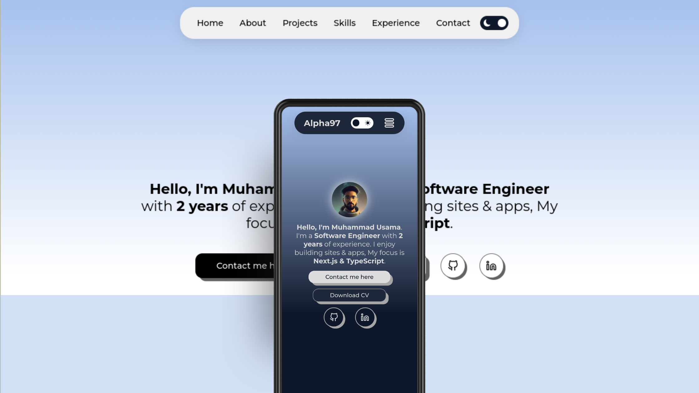

# Alpha97 - Personal Portfolio

Welcome to my personal portfolio repository. This portfolio showcases my work, skills, and experience as a developer. You can explore the live website [here](https://alpha97-personel-portfolio.vercel.app/).

## Overview

Alpha97 - Personal Portfolio is a Next.js web application developed to provide an interactive and informative platform to present my skills, projects, and experience. It features both light and dark themes, allowing visitors to customize their viewing experience. The portfolio also incorporates custom data, demonstrating my proficiency as a Software Engineer.

## Live Website

Explore the live website: [Alpha97 - Personal Portfolio](https://alpha97-personel-portfolio.vercel.app/)

## Features

- **Custom Data**: All the content on this portfolio is personalized and tailored to highlight my skills, projects, and achievements.

- **Light and Dark Mode**: Choose your preferred viewing mode with our user-friendly theme switcher. The portfolio supports both automatic mode (based on your system preferences) and manual mode.

- **Contact Form**: You can easily get in touch with me using the contact form. Send me a message, and I'll get back to you as soon as possible.

## Light and Dark Mode

Alpha97 - Personal Portfolio supports both light and dark modes, giving visitors the flexibility to choose their preferred viewing experience. The theme is controlled by the user's system preference by default, but users can also manually toggle between modes using the provided theme switcher.

### Switching Themes

- **Manual Mode**: If you prefer one mode over the other, you can manually toggle between light and dark themes using the theme switcher available on the website.

## Implementation Details

The light and dark mode implementation is achieved using useContext. The user's choice of theme is stored in useContext API.

## Usage

To provide a consistent dark mode experience, ensure that your projects also support dark mode styling for any embedded content on your portfolio.

## Contributing

Contributions to enhance and optimize the light and dark mode features are welcome! If you have ideas for improvement or wish to contribute, please open a pull request or create an issue.

## Contact

Feel free to reach out with any questions or opportunities. You can use the contact form on my portfolio website or send me a direct message on [LinkedIn](https://www.linkedin.com/in/alpha97/).

Thank you for visiting my portfolio and for considering me for potential opportunities.
